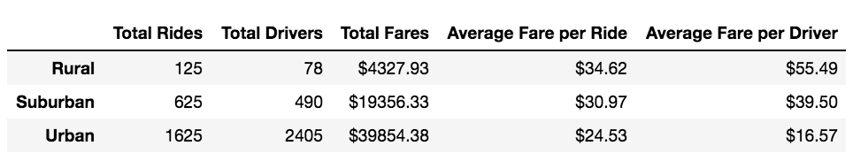

# PyBer_Analysis

## Overview of the analysis: 

While working for a python-based rideshare app called PyBer, you and your coworker are tasked with exploring the relationship between the type of city and the number of drivers and riders as well as the percentage of total fares, riders, and drivers by type of city for the months of January to early May of 2019. After all the data has been analyzed, create visualizations using Pandas and Matplotlib that shows the weekly fares for each type. This information will then be presented to the board to help improve access to ride-share services and determine affordability for underserved neighborhoods. 

## Results: 

The chart below is a condensed snapshot that shows per city type the total number of rides, total number of drivers, total fares, average fare per ride, and average fare per driver. As you see, there are significantly more rides in urban cities than there are in suburban or rural areas. The number of drivers also follows that same pattern with more drivers being in the urban cities. The average fare per ride and average fare per driver is the most expensive in rural areas and cheaper in urban cities. This tells us that in areas with more drivers available the ride fares become cheaper on average. Unfortunately, one thing that the data fails to consider is the length of the rides. Rural areas are larger and require more time to get from one place to another as oppose to urban areas where things tend to be nearer to each other. So the increase in average fare can be a result of longer rides. 

This multiline graph gives us a visualization of the rideshare data by type of city. It shows that across all city types the total fares are fairly consistent over time. It also shows that the majority of the profit comes from urban cities followed by suburban and rural cities. Even though the average fare is higher in rural cities, the number of total rides is thirteen times higher in urban cities than in rural cities.

## Summary: 

Based on the results, urban cities have a lower average fare than suburban and rural types, but urban cities have the greatest number of rides. Rural rides have the lowest number of rides but have higher volatility in the average fare. Expanding into Rural areas to bring down the cost of the fare, may drive business up. Lastly, suburban drivers make up less than 13% of the total number of drivers and 30% of the total fares. Focusing on expanding into more suburban areas is worth considering. 
